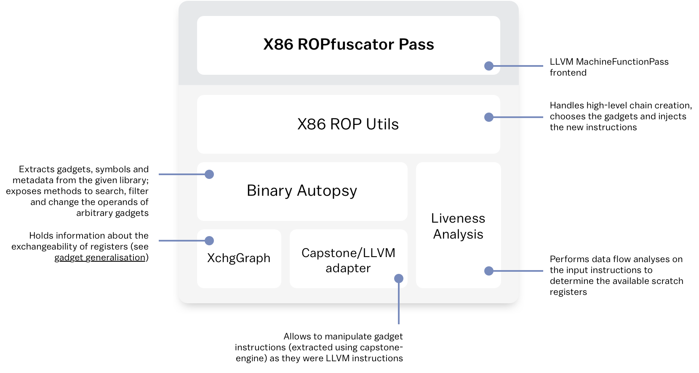

# ROPfuscator


[comment]: <> ()

ROPfuscator is a fine-grained code obfuscation framework for C/C++ programs using ROP (return oriented programming).
ROPfuscator obfuscates a program in assembly code level by transforming normal instructions into ROP chains, thwarting our natural conception of normal control flow.
It is implemented as an extension to LLVM x86 backend.

## ROPfuscator Overview


We combine the following obfuscation layers to achieve robust obfuscation against several attacks.

- ROP Transformation
    - Convert each instruction into one or more ROP gadgets, and translate the entire code to ROP chains.
- Opaque Predicate Insertion
    - Translate ROP gadget address(es) into opaque constants.
- Instruction Hiding
    - Hide some of the instructions within the opaque predicate implementation so that it cannot be identified easily.

## Robustness and Performance Overhead

ROPfuscator deals with the following threat model:

- Decompilers
- Static ROP chain recovery
- Dynamic symbolic execution (DSE)
- Dynamic ROP chain recovery

There is a trade-off between robustness and performance. Generally, if more obfuscation layers are applied, the program is more robust and runs more quickly, and has larger size.

|algorithm   |||Threat        ||||Performance   ||
|----|----|----|---|----|---|----|-------|-------|
|ROP |OP  |IH  |Dec|SROP|DSE|DROP|Time   |Size   |
| -  | -  | -  | - | -  | - | -  |1x     |1x     |
| X  | -  | -  | X | -  | - | -  |200x   |15x    |
| X  | X  | -  | X | X  | X | -  |4000x  |2500x  |
| X  | X  | X  | X | X  | X | X  |3000x  |2000x  |

(ROP = ROP Transformation, OP = Opaque predicate insertion, IH = Instruction Hiding, Dec = Decompilers, SROP = Static ROP chain recovery, DSE = Dynamic symbolic execution, DROP = Dynamic ROP chain recovery)

These obfuscation methods can be chosen per function; it means that ROPfuscator can be configured to obfuscate sensitive functions with stronger algorithm, while the other parts with weaker algorithm to meet both robustness and performance requirements.

## Features

- ROP Transformation
    - Gadgets are automatically extracted from `libc` or from a custom library according to configuration.
    - Gadget addresses are referenced using **symbol anchoring**: each gadget is referenced using a random symbol within the provided library and its offset from it. Since symbol addresses are automatically resolved at runtime by the dynamic loader (`ld`), we can guarantee to reach the wanted gadget even if the library is mapped in memory at a non-static address. This makes ROPfuscator work well with ASLR. It also avoids symbol conflict by excluding symbols from other libraries (based on configuration) and the obfuscated program itself.
    - **Data-flow analysis**: in case of need of a scratch register where to compute temporary values, only registers that don't hold useful data are used.
    - **Gadget generalization** through the **Xchg graph** allows to parametrize gadget instruction operands, giving the possibility to re-use the same gadgets but with different operands. This way we ensure that instructions are correctly obfuscated even in case the number of extracted gadgets is very restricted.
    - Supported instructions: `mov`, `add`, `sub`, `cmp`, `call`, `jmp`, `je` and many more instructions are supported; obfuscation coverage is about 60-80% with typical programs (optimization option `-O0`).
- Opaque Predicates
    - Using **opaque constants** to obfuscate both gadget addresses and immediate operands against static analysis
    - Supported algorithms: Integer factorization-based, Random 3SAT-based
    - **Mixture of general purpose registers**: use register values (highly possibly include user-input values) as opaque predicate inputs, which massively slows down dynamic symbolic execution (DSE) analysis
    - **Mixture of invariant and contextual opaque predicates**: use contextual opaque predicate (output changes based on input values) to avoid opaque predicate identification attack by pattern matching
    - **Stack mangling**: using constants saved on stack as opaque predicate input, to avoid easy analysis of opaque predicates
    - (optional feature) **branch divergence** to invoke equivalent gadgets randomly.
- Instruction Hiding
    - Pick up some instructions and embed them into insertion points in opaque predicates.
    - **Dummy code insertion**: to avoid identification of hidden code, it inserts dummy instructions to other insertion points. If the stack mangling is used in opaque predicates, it also tries to modify stack-saved constants to intertwine dummy code with opaque predicate semantics so that it is even harder to analyze.

## Supported platform

- Linux 32-bit x86 binary is the only supported target (as of now)
- Tested on the following platform, though it is expected to work on other Linux x86 distribution.
    - Host (compiler): Ubuntu 18.04 (64bit)
    - Target (runtime): Ubuntu 18.04 (64bit OS with 32bit support / 32bit OS)
- Compatible LLVM versions: 7, 8, 9, 10

## Limitations

- Generated binaries depends on the specific version of `libc` used at compile time. This means that the generated binary is locked to specific environment, and the program may not work after libc update. Therefore, it is highly recommended that the library from which the gadgets are extracted is distributed along with the obfuscated program.
- Programs need to be built as PIE (position independent executable) without PIC option (i.e. with `-pie` in linking, and without `-fpic` in compiling).
- Inline assembly (`asm`) written in the source code cannot be obfuscated.
- Some version of `libc` may not have enough gadgets to obfuscate fundamental instructions, and can result in very low obfuscation coverage. If this happens, another version of `libc` or other library to which the program is linked should be used instead.
- Enabling optimization may lower obfuscation coverage (and robustness); it is recommended to disable optimization for functions which are to be obfuscated.
- Current implementation does not consider any defense measures or malware detection mechanisms against ROP exploitation.

## Manual Build

### Build dependencies

- `ninja`
- `pkg-config`
- `cmake`, version `>= 3.00`
- external libraries (`libfmt==5.2.1`, `tinytoml==0.4`) included in `thirdparty/`
- C++ compiler (clang or g++)

On Ubuntu/Debian distribution, use the following command to install build dependencies:

```
sudo apt-get install cmake ninja-build pkg-config
```

### Compilation

Make sure to be able to clone this repository (and third party repositories in `thirdparty/` directory) first and then run:

```
wget http://releases.llvm.org/7.0.0/llvm-7.0.0.src.tar.xz
tar -xf llvm-7.0.0.src.tar.xz && rm llvm-7.0.0.src.tar.xz
cd llvm-7.0.0.src
pushd tools
wget https://releases.llvm.org/7.0.0/cfe-7.0.0.src.tar.xz
tar -xf cfe-7.0.0.src.tar.xz && rm cfe-7.0.0.src.tar.xz
popd
pushd lib/Target/X86
git clone --recursive git@bitbucket.org:s2lab/ropfuscator.git
patch < ropfuscator/patch/llvm-7.patch
popd
mkdir build && cd build
cmake -DCMAKE_BUILD_TYPE=Debug -DLLVM_TARGETS_TO_BUILD=X86 -DBUILD_SHARED_LIBS=ON -GNinja ..
ninja llc
```

### Project configuration

There are a couple of flags that are worth to be mentioned when configuring the build:

- `-DCMAKE_BUILD_TYPE=Debug`: just to obtain a debug build (more flexible)
- `-DLLVM_TARGETS_TO_BUILD=X86`: we're interested only in the X86 platform, so we don't want to lose time compiling the backend also for all the other platforms, such as ARM, MIPS, SPARC, etc. This speeds up the compilation process, and make us save up to 4 GB of disk space.
- `-DBUILD_SHARED_LIBS=ON`: shared code is moved in `.so` libraries, that can be linked at runtime, thus speeding up the compilation process even more.
- `-GNinja`: specifies to use `ninja` as build generator. By using `ninja` the overall compile time can decrease by more than 50% (it seems that it has better support to multithreading), but most importantly we can invoke a specific command to compile only `llc`.

Once the project is compiled, we can create a symbolic link to our custom version of `llc`, in order to call it in a simpler way, `ropf-llc`:

```
sudo ln -s [BUILD-DIR]/bin/llc $(HOME)/.local/bin/ropf-llc
```

Make sure that `$(HOME)/.local/bin/` is set in your `PATH` environment variable.

### Recompiling LLC

Since ROPfuscator is a `MachineFunctionPass`, we have to recompile `llc` (LLVM system compiler) each time we modify the pass.
Luckily we're using `ninja-build`, so we don't have to recompile the whole backend; doing this is just a matter of seconds by running:

```
ninja llc
```


## Usage

1. Convert the source code file to obfuscate in LLVM IR:
   ```
   clang [ -m32 ] -O0 -S -emit-llvm example.c
   ```
    - `-m32`: compile in 32-bit mode on 64-bit host (you will need to have `gcc-multilib` installed for this)

    This will create a new file `example.ll`.

2. Compile using our custom LLVM `llc` tool:
   ```
   ropf-llc example.ll [ -march=x86 ]
   ```
    - `-march=x86`: compile in 32-bit mode on 64-bit host

    The output is an asm `example.s` file.

3. Assemble and link:

        [ LD_RUN_PATH='$ORIGIN/' ] gcc -pie example1.s -o example [ -m32 ] [ -lc | -L. -l:libcustom.so ]


    - `-m32`: compile in 32-bit mode on 64-bit host (you will need to have `gcc-multilib` installed for this)

    - `-lc`: only if you used `libc` to extract gadgets and symbols during the linking phase. This will enforce the static linker to resolve the symbols we injected using only `libc`.

    - `-L. -l:libcustom.so`: only if you used a custom library. 
    - `LD_RUN_PATH`: only if you used a custom library. Enforce the dynamic loader to look for the needed libraries in the specified path first. This will ensure that the loader will load your library first, as soon as it is shipped along with the binary.

    Note: we have to use `-pie` to avoid **lazy binding** (aka PLT) to resolve symbols. This is crucial since we need direct function addresses of `libc` rather than the address of PLT entry, to compute gadget address. `gcc` has default compile option `-pie` while `clang` doesn't, so be careful if you are using `clang` instead to link the program. Also note that you should not use `-fpic` in compiling source file to bitcode.

### Build harness

To automate the steps above in existing build scripts (such as `Makefile`), we provide a shell script `ropcc.sh`. It serves both as a compiler and a linker.
The following example compiles `foo.c` and `bar.c` separately, link the objects with `libbaz.so` (obfuscated with config `obf.conf`) to generate an obfuscated binary `exefile`.
You just need to replace C-compiler with `ropcc.sh cc`, and C++-compiler with `ropcc.sh c++`, and supply obfuscation configuration (`-ropfuscator-config=...`).
Command line options are passed to compiler/linker appropriately.
See shell script (comment) for further details.

```
$ ropcc.sh cc -c foo.c -o foo.o
$ ropcc.sh cc -c bar.c -o bar.o
$ ropcc.sh cc -ropfuscator-config=obf.conf foo.o bar.o -lbaz -o exefile
```

### Compiling the examples

While in the `build` directory, run:

```
ninja ropfuscator-examples
```

The compiled examples will be found in the `bin/` directory.


## Docker Build

ROPfuscator supports docker build with [Dockerfile](docker/Dockerfile.llvm7).

```
sh docker/build.sh
```

It will define the following tags:

- `ropfuscator:prebuild-llvm-7`: just before building ropfuscator
- `ropfuscator:build-llvm-7`: after building ropfuscator
- `ropfuscator:llvm-7`: ropfuscator binary (without build files)

In `ropfuscator:llvm-7` image, you can use `clang-7` and `llc` to run ROPfuscator.

```
# (If there are multiple source files)
# compile
clang-7 -m32 -c -emit-llvm foo.c
clang-7 -m32 -c -emit-llvm bar.c
# bitcode link
llvm-link-7 -o out.bc foo.bc bar.bc
# obfuscate and build executable
clang-7 -m32 -pie -o out out.bc
```

```
# compile, link, obfuscate (if there is only one source file)
clang-7 -m32 -pie main.c
```

## Implementation Details

### Original Architecture for ROP Transformation

[comment]: <> ()

