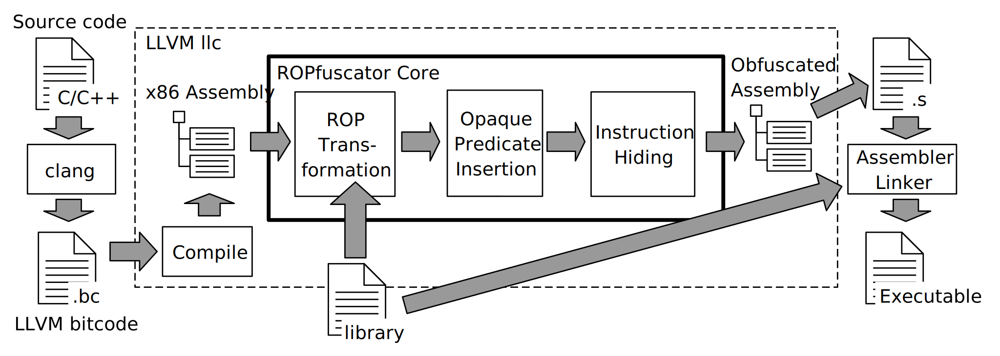

# Disclaimer
 
ROPfuscator is a research proof of concept and is not intended for production use. The authors do not take any responsibility or liability for the use of the software. Please exercise caution and use at your own risk.

---

# ROPfuscator [](https://github.com/ropfuscator/ropfuscator/actions/workflows/main.yaml)


ROPfuscator is a fine-grained code obfuscation framework for LLVM-supported languages using ROP (return-oriented programming).
ROPfuscator obfuscates a program at the assembly code level by transforming regular instructions into ROP chains, thwarting our natural conception of normal control flow.
It is implemented as an extension to LLVM (10.0.1) x86 backend.

For build, usage and implementation, see individual documents:

- Building ROPfuscator: [build.md](./docs/build.md)
- Using ROPfuscator to obfuscate programs: [usage.md](./docs/usage.md)
- Obfuscation algorithm details: [algorithm.md](./docs/algorithm.md)
- Implementation details: [implementation.md](./docs/implementation.md)

## Research Paper

<table>
  <tr>
    <td>
     
     <br>
     <a href="https://wootconference.org/papers/woot23-paper4.pdf">Read the paper here</a>
   </td>
    <td>
     
    @inproceedings{depasquale2023ropfuscator,
      title={ROPfuscator: Robust Obfuscation with ROP},
      author={De Pasquale, Giulio and Nakanishi, Fukutomo and Ferla, Daniele and Cavallaro, Lorenzo},
      booktitle={2023 IEEE Security and Privacy Workshops (SPW)},
      pages={1--10},
      year={2023},
      organization={IEEE}
    }
    
   </td>
  </tr>
</table>

---

## Key Improvements

This project aims to provide an improved version of ROPfuscator with a strong focus on reproducibility and ease of integration. We have made several key enhancements in this repository, as outlined below.

### Nix Package Manager

ROPfuscator now leverages [Nix](https://nixos.org/), a powerful declarative package manager that allows for reliable and reproducible builds. Nix provides several benefits:

- Ensures dependencies and build environments are consistent across systems.
- Allows for isolated build environments, eliminating conflicts with other installed packages.
- Supports rollbacks to previous package versions, making it easier to recover from failed updates.

ROPfuscator provides a Nix flake exposing ROPfuscator's `stdenv`s and various helper functions used to natively compile Nix derivations, without applying any modification to the build system of the project to be built. 

### Evaluation Process

The evaluation process has been rewritten from scratch, taking full advantage of the Nix package manager. This ensures a more reliable and transparent evaluation, which will be the foundation for future work on ROPfuscator.

### Transparent Obfuscation for Upstream Nix Packages

ROPfuscator can now transparently attempt to obfuscate _any_ package present in the upstream Nix package repository, [nixpkgs](https://github.com/NixOS/nixpkgs), without requiring any modifications. This allows Nix users to seamlessly integrate ROPfuscator into their existing workflows and test its capabilities.

ROPfuscator can target a single project, obfuscating only the object files pertinent to the project itself, or it can obfuscate the target along with all its dependencies.

---

## Get started

### Using Nix (recommended)

#### Step 0: Install Nix

Install [Nix](https://nix.dev/tutorials/install-nix) (the package manager) and make sure that its daemon is running.

#### Step 1: Enable Nix to use Flakes

Flakes allow you to specify your code's dependencies in a declarative way and they allow to easily specify inputs and outputs for projects. ROPfuscator exposes different outputs hence we need to enable Nix to use flakes.

[Here](https://nixos.wiki/wiki/Flakes) is a step-by-step process on how to enable them.

#### Step 2: Add ROPfuscator cache repository to Nix's channels (optional) 

This step allows leveraging ROPfuscator's cache repository to avoid recompiling the project and all its dependencies from scratch. This step is optional but recommended.

To enable ROPfuscator's cache, first install `cachix`:

```
nix-env -iA cachix -f https://cachix.org/api/v1/install
```

Then, configure `nix.conf` to use the binary cache:

```
cachix use ropfuscator
```

#### Step 3: Build and use ROPfuscator

The final step is to build ROPfuscator. This can be achieved by invoking:

```
nix build github:ropfuscator/ropfuscator -L
```

If you want to drop in a shell configured to use ROPfuscator by default, just invoke:

```
nix shell github:ropfuscator/ropfuscator
```

ROPfuscator can be used to obfuscate packages that are present in the Nixpkgs repository. Currently, we are using a custom fork because some upstream packages were not properly configured for cross-compilation. Although we have already submitted some of the patches upstream, there is still some work to be done for a seamless experience.

To get started, follow the first two steps listed above and install Nix. Then, copy `flake-example.nix` into a directory, renaming it to `flake.nix`:

```bash
 mkdir -p ropfuscator-example && cd ropfuscator-example
 cp ../flake-example.nix flake.nix
```

At this point, you can build the two packages defined in the flake: `hello` and `obfuscatedHello`.

To build `obfuscatedHello`, use:

```bash
 nix build .#obfuscatedHello -L
```

Similarly, to build `hello` run:

```
 nix build .#hello -L
```
---

## ROPfuscator Overview



We combine the following obfuscation layers to achieve robust obfuscation against several attacks.

- ROP Transformation
  - Convert each instruction into one or more ROP gadgets, and translate the entire code to ROP chains.
- Opaque Predicate Insertion
  - Translate ROP gadget address(es) and stack pushed values into opaque constants, which are composition of multiple opaque predicates.
 
## Configurations

ROPfuscator can be configured through TOML configuration files. [This repository](https://github.com/ropfuscator/utilities/tree/master/configs) includes the following pre-made configurations:

 - **ROP Only**: does not obfuscate gadget addresses, stack values, immediate operands, or branch targets, and does not use opaque predicates.
 - **All Addresses**: obfuscates all gadget addresses and uses opaque predicates for all opaque constants.
 - **Half addresses**: obfuscates 50% of gadget addresses and uses opaque predicates for all opaque constants.
 - **Full**: obfuscates all gadget addresses, stack values, immediate operands, and branch targets, and uses opaque predicates for all opaque constants.

Each configuration can be further customized with the options available in the configuration table in the [README](https://github.com/ropfuscator/utilities/tree/master/configs).

## Limitations

- Linux 32-bit x86 binaries are the only supported target (as of now)
- For detailed limitations, see [limitation.md](./docs/limitation.md).

## Interested in working on ROPfuscator?

We encourage collaboration and are open to discussing potential extensions or improvements to the project. If you are interested in contributing, please reach out to us or open an issue.

Thank you for your support!
