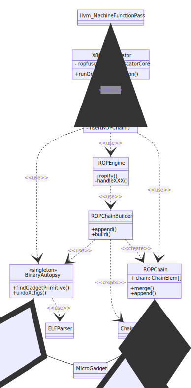

# ROPfuscator Implementation Details

## Main Engine

ROPfuscator is implemented as LLVM `MachineFunctionPass`.

### LLVM Design Details

LLVM is designed to process programs written in high-level languages (e.g., C/C++) in 2 phases: frontend and backend.
The frontend will process source code and generate LLVM IR code. The backend then transforms the LLVM IR to architecture-dependent native code. For example, clang is a frontend for C/C++ and compiles source code into LLVM IR. LLVM x86 backend translates LLVM IR to x86 assembly code, then assembles it to native binary.

LLVM has several extension points in both frontend and backend. Addons using frontend extension points can operate on LLVM IR level, while addons using backend extension points can operate on native code level. We use the latter backend extension point for obfuscation, since we need to work on assembly-level, not IR-level.

To implement assembly-level obfuscation transformation, we derive from `MachineFunctionPass` interface and implement `runOnMachineFunction` function, which is called for each `MachineFunction`. `MachineFunction` provides an access to machine-code level basic blocks (`MachineBasicBlock`), which contains assembly code. Our implementation manipulates (rewrites) the instructions in each `MachineBasicBlock`. Note that we also use global analysis to collect function names etc.

## Class diagram

### Overview and ROP Transformation

The overview of ROPfuscator class structure is shown below.

As noted above, we extend `MachineFunctionPass` interface to implement `X86ROPfuscator` class. This pass is executed as one of the LLVM X86 transformation steps, where the implementation is patched (see `patch/` directory).

`MachineFunctionPass` just delegates its operation to `ROPfuscatorCore`, which does the actual job for obfuscation transformation. `ROPfuscatorCore` translates each instruction into ROP chain using `ROPEngine`, merge the ROP chains, optionally apply opaque predicates and instruction hiding, and replaces the original code with obfuscated instruction sequences. `ROPEngine` uses `ROPChainBuilder` helper class to pick up appropriate ROP gadgets (`Microgadget` class) and generate a ROP chain (`ROPChain` class, which is a set of `ChainElem` class). Each ROP chain element is either a ROP gadget address (refer to `Microgadget`) or an immediate value (to be popped at runtime).

Assembly code generation can be done by LLVM API (`BuildMI` function), but this API is relatively low-level and requires developers to ensure accurate number/types of arguments depending on assembly instructions - otherwise it crashes at run-time. To avoid complication, we created `X86AssembleHelper` class which is solely responsible for assembly code generation. All classes in ROPfuscator should use this helper class if they are emitting x86 instructions.
Also, we use `StackState` class to keep track on the current values stored in the stack at runtime.

All the implemented classes other than original LLVM classes are under `ropf::` namespace. Some classes are under sub-namespaces, such as `PrimeNumberGenerator` class under `ropf::math::` namespace.

### Opaque Predicates and Instruction Hiding

`ROPfuscatorCore` class translates `ROPChain` into a set of assembly instructions, and during this process, it incorporates opaque predicates and instruction hiding (optionally, based on configuration).
In the process, it "lowers" `ROPChain` into a set of `ROPChainPushInst` instances, which handle code generation.
`ROPfuscatorCore` uses `OpaqueConstructFactory` to create/attach an opaque constant (instance of `OpaqueConstruct`) to each `ROPChainPushInst`.
It uses `InstrSteganoProcessor` class to convert some part of the ROP chain into `SteganoInstr` instances, and attach it to `ROPChainPushInst`.
Finally, the instances of `ROPChainPushInst` generate code considering associated `OpaqueConstruct` and `SteganoInstr`.

## Execution flow

Sequence diagram is shown below.

LLVM x86 backend invokes `X86ROPfuscator` pass for each machine function. This pass just calls `ROPfuscatorCore::obfuscateFunction()` and do the main job.

`ROPfuscatorCore` obtains `BinaryAutopsy` instance. This instance is a singleton, and when it is initialized first, it analyze the ELF library and extract ROP gadgets. ELF analysis is done using `ELFParser` class, which eventually calls LLVM `ELF32LEFile` implementation. The extracted ROP gadgets are classified into categories and stored within `BinaryAutopsy` instance for later retrieval upon query. The classification is represented by `GadgetType` enum class.

Then, `ROPfuscatorCore` performs ROP transformation by calling `ROPEngine::ropify()` for each machine instruction. `ROPEngine::ropify()` handles the given instruction by calling dedicated `ROPEngine::handleXXX()` (for example, `handleMovRM`) functions. Those functions actually generate a ROP chain corresponding to each machine instruction.

To generate ROP chains, `ROPEngine` uses `ROPChainBuilder` helper class. `ROPChainBuilder` has `append()` and `build()` interfaces. `ROPChainBuilder::append()` takes gadget type and pseudo registers, and find an appropriate gadget automatically, by querying `BinaryAutopsy` (`BinaryAutopsy::findPrimitiveGadget()`). If the gadget is not directly found, it tries to rename registers by means of exchange (`xchg`) gadget. `ROPChainBuilder::build()` finally do all clean-up jobs such as restoring exchanged registers, and returns combined ROP gadgets as a ROP chain.

After the ROP chain is generated by `ROPEngine::ropify()`, `ROPfuscatorCore::insertROPChain()` replaces original instructions with ROP chain (in assembly code).
Before translation, Instruction Hiding (`InstrSteganoProcessor::convertROPChainIntoStegano()`) is called to pick up some of the instruction to be hidden later in opaque predicates, if enabled in the obfuscation configuration. The instructions picked up are mixed with a number of dummy instructions for increased stealthiness. The following process only handles the remaining ROP chain elements which are not chosen by instruction hiding.
The ROP chain instance which `ROPEngine::ropify()` returns (`ROPChain` class) is relatively high-level representation. Before translating it into assembly code, each ROP element is converted to `ROPChainPushInst` instance. In this process, opaque constants are generated (`OpaqueConstructFactory::createOpaqueConstant32()`) and associated with `ROPChainPushInst`. At the same time, instructions to be hidden are scattered across the generated `ROPChainPushInst` instances. according to the obfuscation configuration. Finally, `ROPfuscatorCore::insertROPChain()` generates raw machine instructions from `ROPChainPushInst`s and replace them with original instructions.

## Details of each file

- Main module
    - X86ROPfuscatorPass.cpp
        - Interface of ROPfuscator to LLVM `MachineFunctionPass`
    - ROPfuscatorCore.cpp/.h
        - The main module for obfuscation transformation
- Obfuscation algorithms
    - ROPEngine.cpp/.h
        - ROP transformation (converting machine instructions into ROP chains)
    - LivenessAnalysis.cpp/.h
        - Extract temporarily available (free) registers so that we can utilize them in ROP chain computation
    - XchgGraph.cpp/.h
        - Register exchange management in ROP transformation
    - BinAutopsy.cpp/.h
        - Analyze ELF binary to extract gadgets and symbol names
    - OpaqueConstruct.cpp/.h
        - Opaque predicates and constants implementation
    - InstrStegano.cpp/.h
        - Instruction hiding implementation
- Data types
    - Symbol.h
        - Data type for ELF symbols (used in `BinAutopsy`)
    - Section.h
        - Data type for ELF sections and segments (used in `BinAutopsy`)
    - Microgadget.h
        - Data type for microgadgets
    - ChainElem.h
        - Data type for each chain element (ROP gadget, immediate value, etc.)
- Miscellaneous utilities
    - ROPfuscatorConfig.cpp/.h
        - Obfuscation configuration management in TOML format (depends on a third-party `tinytoml` library)
    - MathUtil.cpp/.h
        - Utility module for random number generators, prime number test, etc.
    - detail/primetestdata{32,64}.h
        - Auxiliary data for MathUtil.cpp
        - Note that these files are based on third-party software and have separate license.
    - Debug.cpp/.h
        - Message logging framework (depends on a third-party `libfmt` library)

